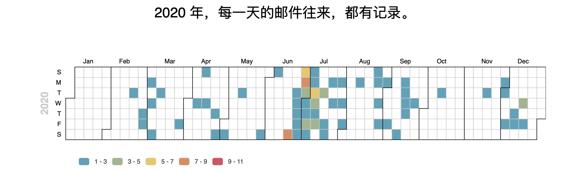
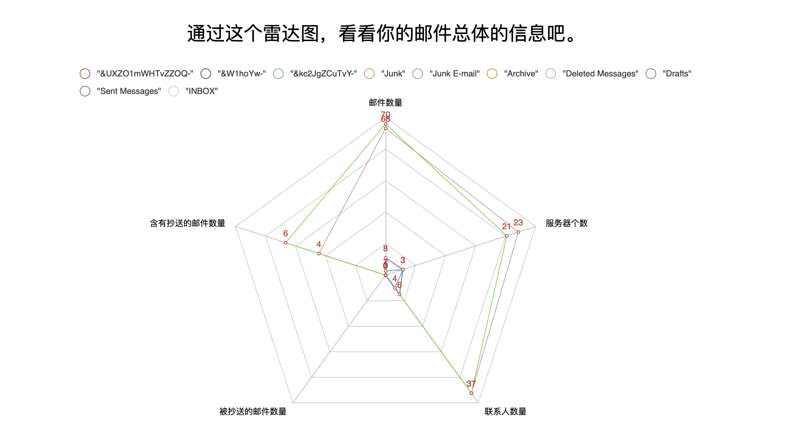

# 📧 Visualize Your Email

Visualize Your Email 利用邮箱协议来获取您邮箱中的邮件，根据一些元数据进行分析并且可视化。您可以通过此网站来查看您邮箱任意一年的可视化数据。

[[Demo](http://v.api.ifffff.cn/)] [[User Guide](https://cynricfeng.github.io/Visualize-Your-Email/)]

## 可交互的可视化

### 日历

日历中记录了在这一年中每一天您邮箱内邮件往来的数量，颜色越深，邮件数量越多，可用的操作如下：

- 鼠标悬浮在某一天的方块上，可以看到具体的邮件数量。
- 点击下方的图例，可以选择某一范围内的邮件数量是否在日历图中显示。

### 旭日图

旭日图记录了您在不同的时段、在不同的邮箱中、不同来源邮件的具体数量和相关比例信息，可用的操作如下：

- 鼠标悬浮在某一块上，可以看到这一块对应的实际上邮件数量。
- 点击某一块，可以以此块为中心重新构建旭日图，再次点击中心，可以回到原始旭日图。

### 雷达图

雷达图提供了五维数据的视图，具体的操作如下：

- 鼠标悬浮在图上，可以查看当前图中面积最大的数据中对应的邮箱的五维数据的具体数量。
- 点击上方的图例，可以选择相应邮箱的数据是否显示在雷达图中。

### 散点图

散点图记录了您每个月，每个邮箱在白天或者晚上的邮件的数量，具体的操作如下：

- 点击上方的播放按钮，散点图会自动按照月份的顺序开始播放，再次点击会暂停。
- 点击对应的月份，可以直接跳转相应月份所在的散点图。
- 点击左边或者右边的箭头，可以向前或者向后前进一个月份。
- 鼠标悬停在对应的点上，可以看到此点对应的具体数据。
- 点击上方图例，可以选择白天数据或者晚上数据是否显示在图中。

### 词云

词云中包含了这一年中出现在您邮件 Subject 中的一些词语，具体操作如下：

- 将鼠标悬停在某一个词语上，可以看到此词语在这一年中出现的次数。