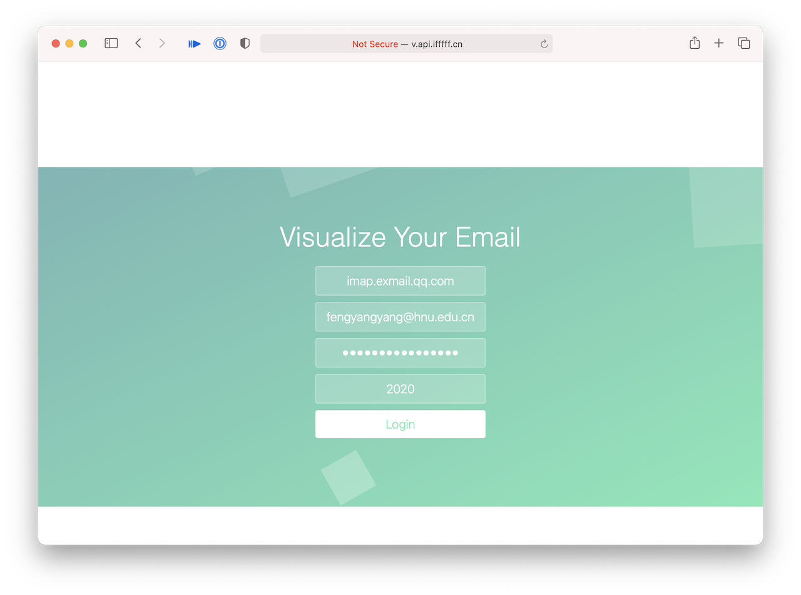
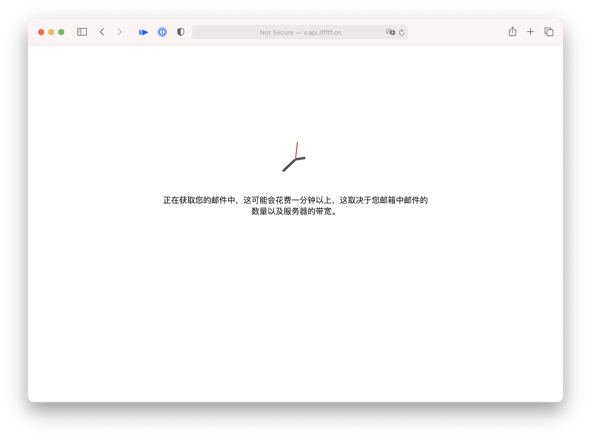
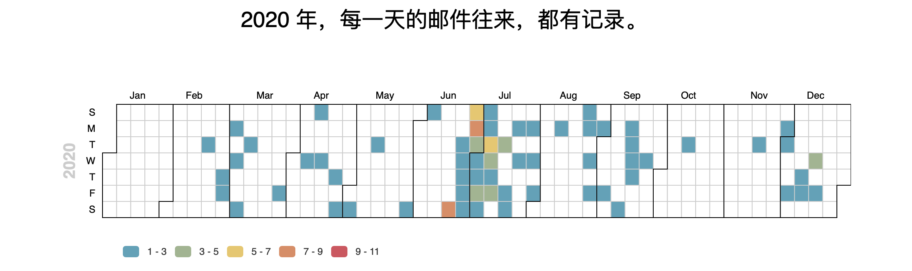
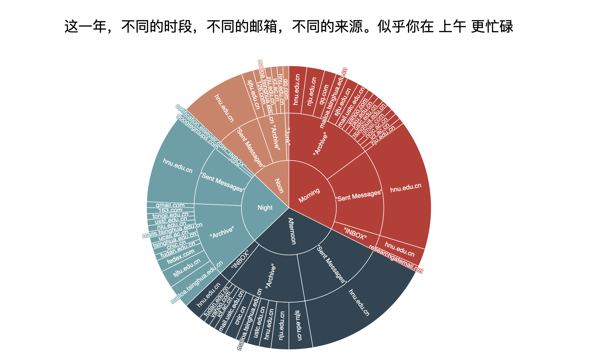
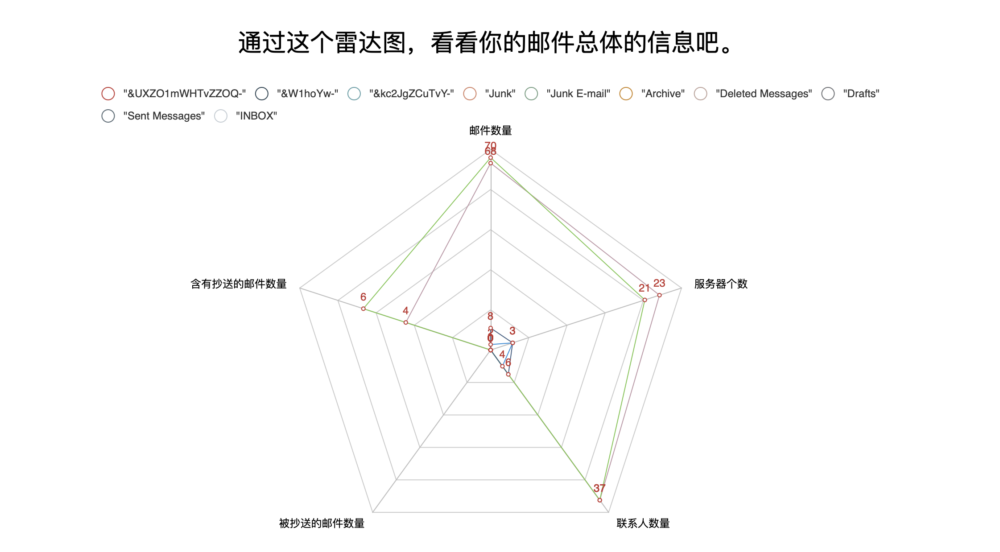
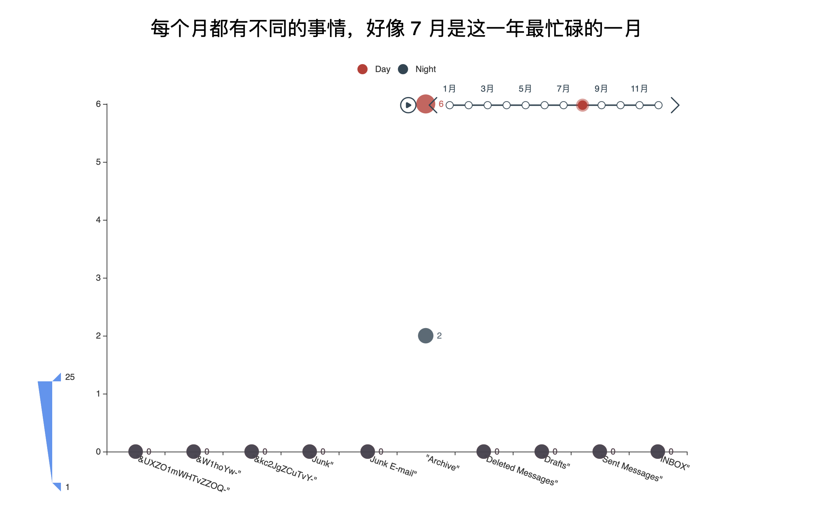
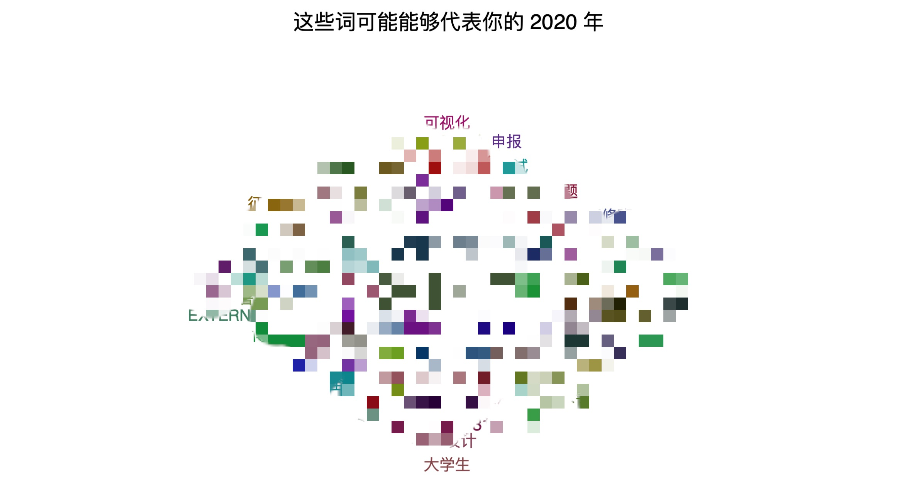

# 📧 Visualize Your Email User Guide

Visualize Your Email 利用邮箱协议来获取您邮箱中的邮件，根据一些元数据进行分析并且可视化。您可以通过此网站来查看您邮箱任意一年的可视化数据。

[[Demo](http://v.api.ifffff.cn/)] [[User Guide](https://cynricfeng.github.io/Visualize-Your-Email/)]

## 基本操作

Visualize Your Email 的操作十分简单，但是由于各个邮件服务提供商的配置不同，可能需要您进行部分操作。以下的操作以腾讯企业邮箱为例，其他种类邮箱的操作类似，可能只有操作界面的位置可能有所不同。

⚙️ 如果您熟悉如何配置邮箱客户端，可以忽略此教程，直接以配置邮箱客户端的方式使用此网站。

⚙️ 或者您可以参考此 [教程](https://zhuanlan.zhihu.com/p/265684163) 。

### 邮箱设置

如果您之前从未使用过第三方的邮箱软件，您可能需要做一些基本的配置来允许您的邮箱可以在第三方的软件上登录，这包括但不限于：

* 打开邮箱的接收服务器。
* 设置可以拉取的邮件数量。
  * ⚠️ 由于网站在一个配置很低的服务器上运行，建议拉取的邮件数量不要超过 200 封，否则可能出现计算错误。
* 设置允许拉取邮箱的文件夹。
* 设置邮箱的客户端专有密码。

您可以参考此 [教程](https://zhuanlan.zhihu.com/p/265684163)，或者查看  <a href="#qaa">常见问题</a>。

### 登录

在登录过程中，需要有填写以下信息：

* Host：您邮箱的接收服务器（imap、smtp、pop 等）
  * 如何获取 Host 地址请参考下面的  <a href="#qaa">常见问题</a>
  * 有部分邮箱可能需要您手动开启 Host 的相关权限
  * 腾讯企业邮箱的 Host 地址为 [imap.exmail.qq.com](http://imap.exmail.qq.com)
* Username：您的邮箱账号
* Password：您的邮箱密码
  * 部分邮箱需要使用应用专属密码，如何获取可以参考  <a href="#qaa">常见问题</a>
* Year：您想可视化的年份

点击登录之后您可能会看到以下的画面，这个时候服务器会开始解析您在这一年中的所有邮件，这可能会花费一定的时间，这取决于您邮箱中的邮件数量和邮箱服务商的服务器的带宽。如果您输入的信息有问题，会提示输入错误。

## 可交互的可视化

### 日历

日历中记录了在这一年中每一天您邮箱内邮件往来的数量，颜色越深，邮件数量越多，可用的操作如下：

* 鼠标悬浮在某一天的方块上，可以看到具体的邮件数量。
* 点击下方的图例，可以选择某一范围内的邮件数量是否在日历图中显示。

### 旭日图

旭日图记录了您在不同的时段、在不同的邮箱中、不同来源邮件的具体数量和相关比例信息，可用的操作如下：

* 鼠标悬浮在某一块上，可以看到这一块对应的实际上邮件数量。
* 点击某一块，可以以此块为中心重新构建旭日图，再次点击中心，可以回到原始旭日图。

### 雷达图

雷达图提供了五维数据的视图，具体的操作如下：

* 鼠标悬浮在图上，可以查看当前图中面积最大的数据中对应的邮箱的五维数据的具体数量。
* 点击上方的图例，可以选择相应邮箱的数据是否显示在雷达图中。
* ⚠️ 图例的颜色和实际图中的线条颜色不统一，这似乎是 pychart 的 bug，在官方样例中也是不统一的。

### 散点图

散点图记录了您每个月，每个邮箱在白天或者晚上的邮件的数量，具体的操作如下：

* 点击上方的播放按钮，散点图会自动按照月份的顺序开始播放，再次点击会暂停。
* 点击对应的月份，可以直接跳转相应月份所在的散点图。
* 点击左边或者右边的箭头，可以向前或者向后前进一个月份。
* 鼠标悬停在对应的点上，可以看到此点对应的具体数据。
* 点击上方图例，可以选择白天数据或者晚上数据是否显示在图中。

### 词云

词云中包含了这一年中出现在您邮件 Subject 中的一些词语，具体操作如下：

* 将鼠标悬停在某一个词语上，可以看到此词语在这一年中出现的次数。

## <a id="qaa">常见问题</a>

> 如何查看自己邮箱的 HOST 地址？

一般在邮箱的网页版中会有 **客户端设置** 的选项，您可以在其中找到接收服务器的地址。

* 在腾讯企业邮箱中：点击上方的 **设置**，选择最后的 **客户端设置**，在设置方法中可以看到接收服务器的地址。
* 在 QQ 邮箱中：点击上方 **设置**，选择 **账户**，下拉到 **POP3/IMAP/SMTP/Exchange/CardDAV/CalDAV服务**，开启相应服务，然后点击 **什么是 IMAP，它又是如何设置？**。

> 邮箱密码不正确？

很多邮箱处于安全的考虑，对于第三方的应用会使用应用专用密码，您需要根据您的邮箱的具体设置，开启专用密码。

* 在腾讯企业邮箱中：您需要绑定微信，然后打开腾讯企业邮箱小程序，然后点击 **我的邮箱>设置>客户端专用密码**。
* 在 QQ 邮箱中：点击上方 **设置**，选择 **账户**，下拉到**POP3/IMAP/SMTP/Exchange/CardDAV/CalDAV服务**，点击生成授权码。

> 邮件数量不对？

很多邮箱为了避免客户端拉取邮件数量过多，会自动限制只拉取30天的邮件，您需要单独手动根据您想要可视化的时间段进行设置。

* 在腾讯企业邮箱中，点击 **设置>客户端设置>收取选项**，然后在选择需要收取的时间段。
* 在 QQ 邮箱中，点击 **设置>账户>POP3/IMAP/SMTP/Exchange/CardDAV/CalDAV服务**，然后在选择需要收取的时间段。

除此之外，有些邮箱的部分字段存在问题，所以有可能部分数据不太准确。

> 出现乱码？

有部分邮箱使用了特有的编码，后台在解码的时候出现了无法解码的问题，这类问题大多出现在中文邮箱名称上面。

> 如何在自己的服务器上部署？

TODO

## 隐私协议

Visualize Your Email Demo 网站对您做出以下保证：

* 我们不会在服务器端保留您的任何个人信息，包括但不限于您的邮箱账号、密码、邮件内容、Cookies。
* Visualize Your Email 所有的数据都在内存中进行计算，不会在磁盘中有任何数据保留。
* 我们的程序只会读取您邮件的 Subject、Date、CC、To、From 的信息，我们不会通过邮件协议拉去您邮件内的其他内容，其中包括但不限于您邮件的正文内容、附件等。

但是还需您自己承担相应风险：

* 我们不保证其他人通过抓包等方式来获取您邮箱的密码或者数据。
* 您可能通过截图等方式向其他人分享您的邮箱可视化数据，进而导致您的个人信息泄漏。

我们建议您：

* 使用邮箱客户端专用密码登录邮箱，并且使用本网站后修改您的邮箱密码，使之前的客户端专用密码失效，来保证您邮箱的安全。
* 不要将可视化的信息分享给他人。

⚠️ 您通过本网站登录，就视为您同意本协议的内容，并且愿意承担相应风险。

♥️ 如需帮助，可以联系 fengyangyang@hnu.edu.cn。